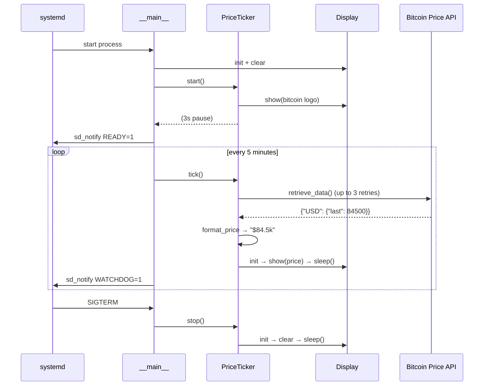

# E-Paper Bitcoin Price Ticker

Displays the current Bitcoin/USD price on a Waveshare 2.13" e-ink display (epd2in13 V2) connected to a Raspberry Pi. On startup it shows a Bitcoin logo, then enters a loop that refreshes the price every 5 minutes. The background alternates randomly between black and white on each refresh.

## Architecture

### Runtime sequence



## Configuration

Edit `config.toml` to customise the behaviour:

```toml
[bitcoin.price]
service_endpoint = "https://blockchain.info/ticker"
currency = "USD"   # currency code returned by the API (e.g. "CHF", "EUR")
symbol = "$"       # symbol shown on the display (e.g. "CHF ", "€")
refresh_interval = 300  # seconds between price refreshes
```

**To display a different currency**, set `currency` to any code the API returns and `symbol` to the label you want shown on screen. For example, to show Swiss francs:

```toml
currency = "CHF"
symbol = "CHF "
```

The `service_endpoint` must return JSON in this shape (the [blockchain.info ticker](https://blockchain.info/ticker) is the default):

```json
{
  "USD": { "last": 84500.0, ... },
  "CHF": { "last": 75000.0, ... }
}
```

Any endpoint that returns this structure works as a drop-in replacement.

## Requirements

- Raspberry Pi (tested on Pi 4 Model B Rev 1.4)
- Waveshare 2.13" e-ink display (epd2in13 V2)
- Python 3.13+

## Install & run

```bash
python -m venv .venv
source .venv/bin/activate
pip install -e ".[rpi]"
python -m epaper
```

If you get permission errors on SPI/GPIO devices, add your user to the required groups (then log out and back in):
```bash
sudo usermod -aG spi,gpio $USER
```

## Development

```bash
python -m venv .venv
source .venv/bin/activate
pip install -e ".[dev]"
pytest
```

## Run as a systemd service (auto-start on boot, auto-restart on failure)

Open `systemd/epaper.service` and adjust `User`, `WorkingDirectory`, and `ExecStart` to match your username and install path before copying it.

```bash
# Install the service unit
sudo cp systemd/epaper.service /etc/systemd/system/
sudo systemctl daemon-reload

# Enable (start on boot) and start immediately
sudo systemctl enable --now epaper

# Check status / logs
systemctl status epaper
journalctl -u epaper -f
```

To stop and disable auto-start:
```bash
sudo systemctl disable --now epaper
```
